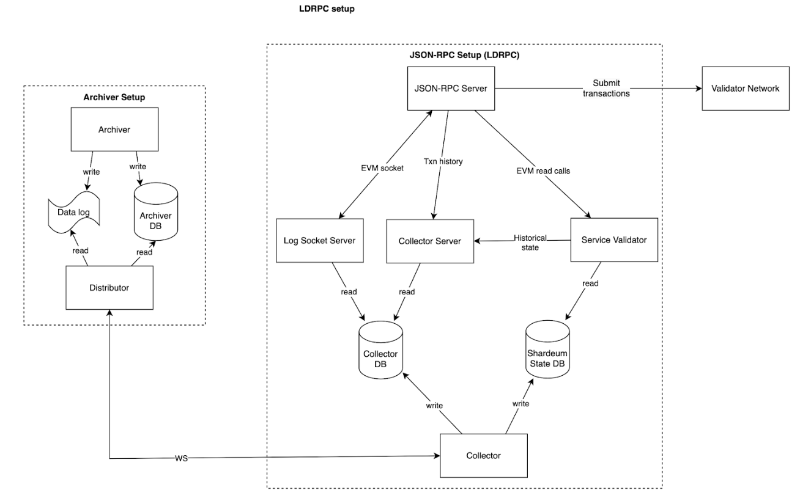

# Collector

The Data Distribution System is designed to efficiently handle the flow of data within the ecosystem. This system involves various components such as Collectors, Archivers, Validators, Distributors, and more. The system revolves around the Collector, which saves incoming data chunks from Archivers or Distributors into log files and an SQLite database. Active Validators generate data passed on to Archivers, which in turn distribute it to various services like Explorers, JSON-RPC servers, and wallets for end-user access.



## Development

1. Clone the repository and switch to `dev` branch

```bash
git clone https://github.com/shardeum/relayer-collector.git
git switch dev
npm install
```

2. Configure the [config.json](./config.json) with correct `distributorInfo` and `collectorInfo`

Set the **ip**, **port**, and **publicKey** of the distributor service in the `distributorInfo` object, and the public and secret keys of the collector service in the `collectorInfo` object. To properly configure and connect to a Distributor service, you will need specific information such as the public key and endpoint details of the Distributor. This information can be obtained in two ways:

- Run the Distributor Locally: If you are developing locally or testing, you can run a Distributor instance on your machine. This will allow you to easily retrieve the necessary configuration details such as the public key and endpoint URL.

- Obtain Information from the Shardeum Production Network: For production deployment or if you are connecting to the main Shardeum network, you can query the `/config` endpoint of the Distributor service. This endpoint will provide you with the necessary configuration details.

3. Update `src/config/index.ts` with the following settings

```bash
enableShardeumIndexer: false,
blockIndexing: {
  enabled: true,
},
enableCollectorSocketServer: false
```

4. Now you can compile the project using the following command

```bash
npm run compile
```

5. Run the collector service

```bash
npm run collector
```

To start the main data collector, run

```bash
pm2 start --name collector-data-server --node-args="--max_old_space_size=16000" npm -- run collector
```

6. Monitor the collector logs

```bash
pm2 logs
```

Check the logs for any errors or issues during startup and operation. By following these steps, you'll have the collector set up and connected to the distributor, ready to receive and process data from the Shardeum network.

## Working

### Collector Service

The Collector service connects to a distributor service as configured in `config.json`. It can be started with the following command:

```bash
npm run collector
```

Here's what the Collector does:

**Data Syncing:** Initiates a data syncing process in which it queries all the historical data (Accounts, Transactions, Receipts etc) from the distributor and saves it to its own SQLite DB.
**Real-time Data Subscription:** Simultaneously, it subscribes to real-time data from the distributor and writes it to a log file (under **`/data-logs`**) and the SQLite DB.

### Server

This API Server is used to expose the data stored in the SQLite DB to the RPC Server, if you intend to point an RPC to the collector data. The server can be started using:

```bash
npm run server
```

### Log Server

The **`log_server`** hosts an endpoint named `/evm_log_subscription`, specifically designed for hosting on-chain event logs like `eth_getLogs`. This feature further enhances the capabilities and accessibility of the system.

The log server can be started using:

```bash
npm run log_server
```

## Contributing

Contributions are highly encouraged! We welcome everyone to participate in our codebases, issue trackers, and any other form of communication. However, we expect all contributors to adhere to our [code of conduct](./CODE_OF_CONDUCT.md) to ensure a positive and collaborative environment for all involved in the project.
